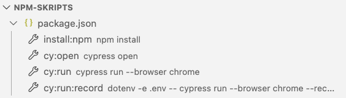
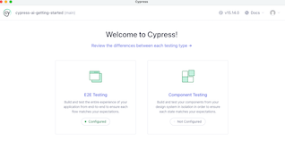

# Cypress AI - Getting Started

Dieses Repository ist die Basis für die Kurse auf https://www.codesurfer.io/schulungen.
Folge dieser Anleitung, um deine Cypress AI Testumgebung einzurichten:

### Voraussetzungen

1. **Visual Studio Code installieren**
   - Lade Visual Studio Code [hier herunter](https://code.visualstudio.com/download) und installiere es auf deinem System

2. **Google Chrome installieren**
   - Benötigt: aktuelle Version von Google Chrome
   - Lade Chrome [hier herunter](https://www.google.com/chrome/)

3. **Node.js installieren**
   - Benötigt: Node.js Version 22 oder neuer
   - Lade Node.js [hier herunter](https://nodejs.org/en/download) oder nutze NVM: `nvm install 22`

### Projekt Setup

4. **Dateien herunterladen**
   - Lade das Projekt [hier herunter](https://github.com/nils-hoyer/cypress-ai-getting-started/archive/refs/heads/main.zip) oder nutze Git: `git clone https://github.com/nils-hoyer/cypress-ai-getting-started.git`

5. **Projekt in Visual Studio Code öffnen**
   - Öffne Visual Studio Code
   - Datei > Ordner öffnen... und wähle den heruntergeladenen Ordner

### Cypress einrichten

Die folgenden Befehle findest du links im Explorer unter "NPM SKRIPTS". Von dort kannst du sie per Klick ausführen.
Die Ausgaben der folgenden Befehle erscheinen im Terminal-Tab im unteren Bereich von Visual Studio Code.

6. **Pakete installieren**
   - Starte Skript "install:npm"
   - Oder nutze Bash: `npm install`
   - Installiert Cypress und alle benötigten Pakete

7. **Setup überprüfen**

   a. Teste Cypress Testausführung im Terminal:
   - Starte Skript "cy:run"
   - Oder nutze Bash: `npm run cy:run`
   - Führt alle Tests im Terminal aus

   

   b. Teste den Cypress UI-Modus:
   - Starte Skript "cy:open"
   - Oder nutze Bash: `npm run cy:open`
   - Öffnet das Cypress App-Fenster. Stelle sicher, dass es sich öffnet

   

Wenn beides erfolgreich funktioniert, bist du bereit für das Seminar!

Happy Testing! 🚀🤖